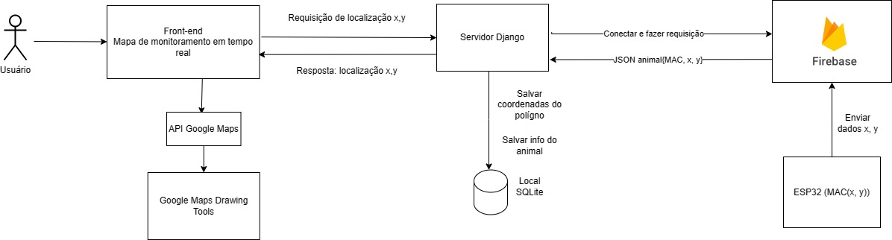

# Animal Trace

#### Integrantes do Grupo:
- Thainara Rocha Cruz
- Jhennifer Aparecida Rodrigues Borges
- Beatriz Fernandes Teixeira
---
## Introdução
Este projeto consiste em uma aplicação que permite o monitoramento de animais numa fazenda utilizando um mapa interativo do Google Maps para permitir que o usuário selecione a região a ser monitorada. As coordenadas do polígono que representam a propriedade são salvas em um banco de dados SQLite. Após a região ser delimitada, é possível adicionar o identificador MAC de um dispositivo (ESP32) acoplado a um animal. O ESP32 é um arduino que se conecta com o Firebase e envia constantemente a localização (as coordenadas geográficas) para este banco de dados em nuvem. A partir dos dados enviados pelo ESP32, a aplicação principal em Django consome o Firebase a partir de sua API e plota a movimentação do animal no mapa.
## Objetivos
- **Rastreamento de Movimentos:** Permitir aos usuários delimitar áreas na fazenda e acompanhar a movimentação dos animais nesses espaços.
- **Integração com Dispositivos IoT:** Facilitar o monitoramento em tempo real por meio da conexão de dispositivos ESP32 acoplados aos animais.

---
## Arquitetura do Sistema Distribuído (Cliente-servidor)

#### **Tipo de arquitetura de sistemas distribuídos**

O tipo de arquitetura de sistemas distribuídos utilizado para este projeto é uma arquitetura **cliente-servidor**. Nesse tipo de arquitetura, os componentes do sistema são divididos em dois tipos: clientes e servidores. Os clientes solicitam serviços aos servidores, que fornecem esses serviços.

Os clientes são **os dispositivos ESP32**, que enviam as coordenadas geográficas dos animais para o servidor Firebase,  um servidor em nuvem que armazena os dados enviados pelos clientes. **A aplicação Django** é um cliente que acessa os dados armazenados no servidor Firebase e os utiliza para plotar a movimentação dos animais no mapa.

**Servidor**
O servidor Firebase (Firestore) é um banco de dados NoSQL (não estruturado) em nuvem que armazena os dados enviados pelos clientes.

Os dados enviados pelos clientes são armazenados no banco de dados Firestore no formato de documentos. Cada documento representa uma coordenada geográfica de um animal.
#### Composição do sistema
A arquitetura do sistema é composta por diferentes elementos:

- **Banco de Dados Local (SQLite):** As coordenadas das áreas delimitadas são armazenadas em um banco de dados SQLite.
- **Integração com Google Maps:** A aplicação integra a API do Google Maps com a ferramenta Drawing Tools para permitir a seleção e salvamento das coordenadas que representam as áreas monitoradas na fazenda.
- **Integração com Firebase:** Os dispositivos ESP32, conectados ao Firebase, enviam constantemente as coordenadas geográficas para este banco de dados em nuvem.
- **Aplicação Django:** Consumindo a API do Firebase, a aplicação Django principal utiliza esses dados para plotar a movimentação dos animais no mapa a partir da utilização das coordenadas fornecidas pelo sensor ESP32.





## Tecnologias Utilizadas

- **Django:** Framework web utilizado para construir a aplicação.
- **SQLite (já embutido no Django):** Banco de dados utilizado para armazenar as coordenadas das áreas delimitadas.
- **Firebase:** Banco de dados em nuvem usado para armazenar as coordenadas de localização enviadas pelos sensores ESP32.
- **Google Maps API (Drawing Tools):** API usada para a interatividade do usuário na seleção das áreas no mapa.
- **PlatformIO (Extensão do VS Code):** Utilizado para gerenciar as operações do dispositivo ESP32.

## Como Executar o projeto

### Configuração e Pré-Requisitos

Instale o Python 3 em sua máquina.

Para executar o projeto localmente, siga estas etapas:
1. Clonar repositório

``` bash
git clone [link do repositório]
```
2. Criar ambiente virtual (Windows)

``` bash
python -m venv venv
```

2. Criar ambiente virtual (Linux)

``` bash
python3 -m venv venv
```

3. Ativar ambiente virtual (Windows)

``` bash
venv\Scripts\activate.bat
```

3. Ativar ambiente virtual (Linux)
``` bash
source venv/bin/activate
```

4. Verifique se possui a ferramenta de gerenciamento de pacotes `pip` .
``` bash
pip --version
```

5. Instale as dependências do projeto.
```bash
pip install -r requirements.txt
```

- Executar o servidor django
```bash
python manage.py runserver
```
- Acessar: http://localhost:8000/admin/login/?next=/admin/

3. Configure as chaves da API do Google Maps e do Firebase alterando o valor das variáveis no arquivo `.env`
### Execução
1. Navegue até o diretório raiz do projeto.
2. Execute o servidor Django: `python manage.py runserver`.
3. Acesse a aplicação em um navegador: `http://localhost:8000/admin/login/?next=/admin/`.

---
# Instruções para Executar o Código ESP32 no Firebase

Este projeto utiliza um ESP32 para se conectar ao Wi-Fi e enviar coordenadas fictícias para o Firebase. Siga as etapas abaixo para configurar e executar o código.

## Pré-requisitos

- [Visual Studio Code](https://code.visualstudio.com/)
- [PlatformIO Extension](https://platformio.org/install/ide?install=vscode)

## Configuração do Projeto

1. Instale a extensão PlatformIO no Visual Studio Code usando o [link recomendado](https://platformio.org/install/ide?install=vscode).
2. Crie um novo projeto no PlatformIO, selecionando a placa `DOIT ESP DEVKIT V1` e o framework `Arduino`.
3. Copie o código presente na pasta `ESP32`, no arquivo `main.cpp`, para o arquivo `src/main.cpp` do seu projeto no PlatformIO.

## Adição da Biblioteca Firebase

4. Importe a biblioteca *Firebase Arduino Client Library for ESP8266 and ESP32* no seu projeto.

## Configuração do Firebase

5. Crie um projeto no Firebase e obtenha a `API_KEY` e a `DATABASE_URL`.
6. Substitua os campos `API_KEY` e `DATABASE_URL` no código pelo valor obtido do Firebase.
7. Configure as variáveis `WIFI_SSID` e `WIFI_PASSWD` com o nome e senha da sua rede Wi-Fi.

## Compilação e Execução

8. Construa e compile o código utilizando as opções fornecidas pelo PlatformIO.

Com estas etapas, o seu projeto estará pronto para enviar coordenadas fictícias para o Firebase usando o ESP32. Certifique-se de ajustar qualquer outra configuração específica do seu projeto, se necessário.

